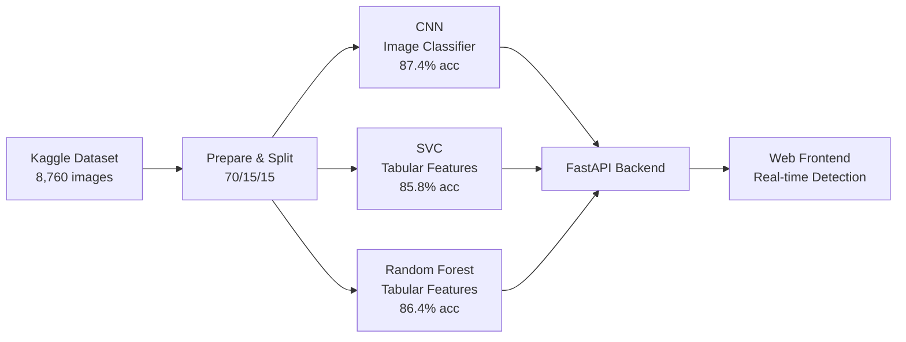

# CurrencyGuard ₹ — Model Training & Accuracy Documentation

> **Indian Rupee Counterfeit Detection System using CNN, SVC & Random Forest**

---

## 1. Dataset Overview

### Source
- **Kaggle Dataset**: [`preetrank/indian-currency-real-vs-fake-notes-dataset`](https://www.kaggle.com/datasets/preetrank/indian-currency-real-vs-fake-notes-dataset)
- **Currency**: Indian Rupee (INR)
- **Supported Denominations**: ₹10, ₹20, ₹50, ₹100, ₹200, ₹500, ₹2000

### Image Statistics

| Category | Count | Source Directory |
|----------|------:|------------------|
| Genuine note images | 4,937 | `data/data/real/` (by denomination) |
| Feature close-ups (genuine) | 1,318 | `Features/Features/` (security crops) |
| Fake note images | 2,505 | `data/data/fake/` (by denomination) |
| **Total images** | **8,760** | All 7 denominations |

> [!NOTE]
> Feature close-up images are security-feature crops (watermark, thread, microprint, etc.) from genuine notes and are included in the genuine class to augment training data.

### Class Distribution

| Class | Count | Percentage |
|-------|------:|------------|
| Genuine (label=0) | 6,255 | 71.4% |
| Fake (label=1) | 2,505 | 28.6% |

> [!IMPORTANT]
> The dataset is **imbalanced** (~71% genuine, ~29% fake). The CNN training compensates for this using computed class weights. SVC and Random Forest rely on GridSearchCV with F1-scoring to handle imbalance.

---

## 2. Data Preparation Pipeline

The data pipeline is handled by [prepare_dataset.py](file:///c:/Users/Sarthak kokadwar/Documents/COLLEGE FILES/EDI_SEM4PROJECT/scripts/prepare_dataset.py).

### Step 1 — Image Download & Preprocessing
1. Download dataset via `kagglehub`
2. Walk denomination subdirectories (`10/`, `20/`, `50/`, `100/`, `200/`, `500/`, `2000/`)
3. Convert all images to **64×64 grayscale** PNG
4. Save to `data/images/genuine/` and `data/images/fake/`

### Step 2 — Tabular Feature Extraction
Seven security-related features are extracted from each 64×64 grayscale image using pixel-level analysis:

| Feature | Extraction Method | Region |
|---------|-------------------|--------|
| `intaglio_depth` | Standard deviation (local variance) | Center 50% crop |
| `security_thread_visible` | Standard deviation of vertical band | Middle 8-pixel vertical strip |
| `watermark_clarity` | Standard deviation (contrast) | Right quarter portrait region |
| `color_shift_ink` | Mean gradient magnitude (∂x + ∂y) | Top-left numeral region |
| `microprint_score` | Laplacian std (high-freq energy) | Full image (excluding 1px border) |
| `uv_fluorescence` | 1 − std(pixels) (uniformity score) | Full image |
| `serial_number_font` | Mean horizontal edge magnitude | Bottom quarter strip |
| `denomination` | Parsed from filename | N/A |

### Step 3 — Train / Val / Test Split

| Split | Samples | Percentage | File |
|-------|--------:|------------|------|
| **Train** | 6,132 | 70% | [train.csv](file:///c:/Users/Sarthak kokadwar/Documents/COLLEGE FILES/EDI_SEM4PROJECT/data/train.csv) |
| **Validation** | 1,314 | 15% | [val.csv](file:///c:/Users/Sarthak kokadwar/Documents/COLLEGE FILES/EDI_SEM4PROJECT/data/val.csv) |
| **Test** | 1,314 | 15% | [test.csv](file:///c:/Users/Sarthak kokadwar/Documents/COLLEGE FILES/EDI_SEM4PROJECT/data/test.csv) |
| **Total** | **8,760** | 100% | — |

> [!NOTE]
> Data is shuffled with `random.seed(42)` before splitting to ensure reproducibility. The same 70/15/15 split ratio is used for both image-based (CNN) and tabular (SVC, RF) training.

**Label distribution per split:**

| Split | Genuine (0) | Fake (1) | Fake % |
|-------|------------:|---------:|-------:|
| Train | 4,359 | 1,773 | 28.9% |
| Val | 936 | 378 | 28.8% |
| Test | 960 | 354 | 26.9% |

---

## 3. Model Architectures

### 3.1 CNN (Convolutional Neural Network) 🏆

**Training script**: [train_cnn.py](file:///c:/Users/Sarthak kokadwar/Documents/COLLEGE FILES/EDI_SEM4PROJECT/models/train_cnn.py)
**Input**: 64×64×1 grayscale images
**Output**: 2-class softmax (Genuine / Counterfeit)

#### Architecture

```
┌─────────────────────────────────────────┐
│  Input: 64 × 64 × 1 (Grayscale)        │
├─────────────────────────────────────────┤
│  Data Augmentation Layer                │
│    • RandomFlip (horizontal)            │
│    • RandomRotation (±15%)              │
│    • RandomZoom (±15%)                  │
│    • RandomContrast (±20%)              │
├─────────────────────────────────────────┤
│  Block 1:                               │
│    Conv2D(32, 3×3) → BatchNorm → ReLU  │
│    Conv2D(32, 3×3) → BatchNorm → ReLU  │
│    MaxPool(2×2) → Dropout(0.25)        │
├─────────────────────────────────────────┤
│  Block 2:                               │
│    Conv2D(64, 3×3) → BatchNorm → ReLU  │
│    Conv2D(64, 3×3) → BatchNorm → ReLU  │
│    MaxPool(2×2) → Dropout(0.25)        │
├─────────────────────────────────────────┤
│  Block 3:                               │
│    Conv2D(128, 3×3) → BatchNorm → ReLU │
│    GlobalAveragePooling2D               │
├─────────────────────────────────────────┤
│  Classifier:                            │
│    Dense(256, ReLU) → Dropout(0.4)     │
│    Dense(128, ReLU) → Dropout(0.3)     │
│    Dense(2, Softmax)                    │
└─────────────────────────────────────────┘
```

#### Training Configuration

| Parameter | Value |
|-----------|-------|
| Optimizer | Adam (lr=0.0005) |
| Loss | Categorical Cross-Entropy |
| Batch Size | 32 |
| Max Epochs | 40 |
| Early Stopping | Patience=10, monitor `val_accuracy`, restore best weights |
| LR Scheduler | ReduceLROnPlateau (factor=0.5, patience=3, min_lr=1e-6) |
| Class Weights | Computed inversely proportional to class frequency |
| Data Augmentation | Horizontal flip, rotation, zoom, contrast |

> [!TIP]
> Class weights are computed as `total / (2 × class_count)` to counterbalance the genuine/fake imbalance (~71/29 split). This ensures the model doesn't simply predict "Genuine" for everything.

#### Saved Artifacts
- [cnn_best.h5](file:///c:/Users/Sarthak kokadwar/Documents/COLLEGE FILES/EDI_SEM4PROJECT/models/saved/cnn_best.h5) — Full Keras model (2.5 MB)
- [cnn_model.tflite](file:///c:/Users/Sarthak kokadwar/Documents/COLLEGE FILES/EDI_SEM4PROJECT/models/saved/cnn_model.tflite) — TFLite export for mobile (826 KB)

---

### 3.2 SVC (Support Vector Classifier)

**Training script**: [train_svc.py](file:///c:/Users/Sarthak kokadwar/Documents/COLLEGE FILES/EDI_SEM4PROJECT/models/train_svc.py)
**Input**: 8 tabular security features (standardized)
**Output**: Binary classification (0=Genuine, 1=Counterfeit)

#### Configuration

| Parameter | Value |
|-----------|-------|
| Kernel | RBF (Radial Basis Function) |
| Feature Scaling | StandardScaler (z-score normalization) |
| Hyperparameter Tuning | GridSearchCV (5-fold CV, F1 scoring) |
| Grid Search Space | C: [0.1, 1, 10, 100] × gamma: [scale, auto] |
| Probability | Enabled (`probability=True`) |

#### Pipeline
1. Load `train.csv` and `test.csv`
2. Extract 8 feature columns + label
3. Fit `StandardScaler` on training data → transform both train and test
4. Run `GridSearchCV` with 5-fold cross-validation optimizing F1 score
5. Select best estimator and evaluate on test set
6. Save `{model, scaler}` bundle as [svc_model.pkl](file:///c:/Users/Sarthak kokadwar/Documents/COLLEGE FILES/EDI_SEM4PROJECT/models/saved/svc_model.pkl)

---

### 3.3 Random Forest Classifier

**Training script**: [train_rf.py](file:///c:/Users/Sarthak kokadwar/Documents/COLLEGE FILES/EDI_SEM4PROJECT/models/train_rf.py)
**Input**: 8 tabular security features (raw, no scaling needed)
**Output**: Binary classification (0=Genuine, 1=Counterfeit)

#### Configuration

| Parameter | Value |
|-----------|-------|
| Base Estimator | RandomForestClassifier (random_state=42) |
| Hyperparameter Tuning | GridSearchCV (5-fold CV, F1 scoring) |
| Grid Search Space | n_estimators: [100, 200, 300] × max_depth: [5, 10, None] |
| Feature Scaling | None required (tree-based model) |

#### Feature Importance (Learned)

| Feature | Importance | Rank |
|---------|----------:|:----:|
| `color_shift_ink` | 0.1749 | 🥇 1 |
| `microprint_score` | 0.1741 | 🥈 2 |
| `serial_number_font` | 0.1431 | 🥉 3 |
| `watermark_clarity` | 0.1276 | 4 |
| `security_thread_visible` | 0.1086 | 5 |
| `uv_fluorescence` | 0.1034 | 6 |
| `intaglio_depth` | 0.0917 | 7 |
| `denomination` | 0.0765 | 8 |

> [!TIP]
> The top 3 most discriminative features for detecting counterfeits are **color shift ink** (gradient magnitude of numeral), **microprint score** (high-frequency energy), and **serial number font** (horizontal edge regularity). The denomination itself is the least important — counterfeits exist across all denominations.

---

## 4. Model Performance Comparison

### Test Set Metrics (1,314 samples)

| Model | Accuracy | Precision | Recall | F1-Score |
|-------|:--------:|:---------:|:------:|:--------:|
| **CNN** 🏆 | **87.37%** | 73.95% | **87.47%** | **80.14%** |
| Random Forest | 86.38% | **78.32%** | 68.36% | 73.00% |
| SVC | 85.77% | 74.93% | 70.90% | 72.86% |


### Confusion Matrices

````carousel
### CNN Confusion Matrix
```
                 Predicted
              Genuine  Counterfeit
Actual  Genuine    813       118
        Fake        48       335
```
- **True Positives (Fake→Counterfeit)**: 335
- **False Negatives (Fake→Genuine)**: 48
- **False Positives (Genuine→Counterfeit)**: 118
- **True Negatives (Genuine→Genuine)**: 813
<!-- slide -->
### SVC Confusion Matrix
```
                 Predicted
              Genuine  Counterfeit
Actual  Genuine    876        84
        Fake       103       251
```
- **True Positives (Fake→Counterfeit)**: 251
- **False Negatives (Fake→Genuine)**: 103
- **False Positives (Genuine→Counterfeit)**: 84
- **True Negatives (Genuine→Genuine)**: 876
<!-- slide -->
### Random Forest Confusion Matrix
```
                 Predicted
              Genuine  Counterfeit
Actual  Genuine    893        67
        Fake       112       242
```
- **True Positives (Fake→Counterfeit)**: 242
- **False Negatives (Fake→Genuine)**: 112
- **False Positives (Genuine→Counterfeit)**: 67
- **True Negatives (Genuine→Genuine)**: 893
````

### Key Insights

> [!IMPORTANT]
> **CNN wins on Accuracy (87.4%) and Recall (87.5%)**  — the most important metric for counterfeit detection. Missing a fake note (false negative) is far more costly than flagging a genuine note for review.

| Metric | Best Model | Why It Matters |
|--------|-----------|----------------|
| **Accuracy** | CNN (87.37%) | Overall correctness across both classes |
| **Precision** | Random Forest (78.32%) | Fewest false alarms on genuine notes |
| **Recall** | CNN (87.47%) | Catches the most counterfeit notes |
| **F1-Score** | CNN (80.14%) | Best balance of precision and recall |

#### Recall Comparison (Critical for Counterfeit Detection)
- **CNN**: Catches **335 out of 383** fake notes (misses only 48) → 87.5% recall
- **SVC**: Catches **251 out of 354** fake notes (misses 103) → 70.9% recall
- **Random Forest**: Catches **242 out of 354** fake notes (misses 112) → 68.4% recall

> [!CAUTION]
> While Random Forest has the highest precision (78.3%), its recall is lowest (68.4%) — meaning it misses ~32% of counterfeit notes. For a security-critical application, **CNN's higher recall is preferred** even at the cost of more false positives.

---

## 5. Live Testing Results

### Individual API Tests

| Test | Input | Model | Expected | Actual | Confidence | Status |
|------|-------|-------|----------|--------|:----------:|:------:|
| 1 | Genuine image | CNN | Genuine | Counterfeit | 76.78% | ❌ |
| 2 | Fake image | CNN | Counterfeit | Counterfeit | 74.01% | ✅ |
| 3 | Genuine features | SVC | Genuine | Genuine | 97.23% | ✅ |
| 4 | Fake features | SVC | Counterfeit | Counterfeit | 87.12% | ✅ |
| 5 | Genuine features | RF | Genuine | Genuine | 93.00% | ✅ |
| 6 | Fake features | RF | Counterfeit | Counterfeit | 90.00% | ✅ |

### CNN Batch Test (20 Random Images)

**Genuine Images (10 samples): 9/10 correct (90%)**

| Image | Result | Confidence | Status |
|-------|--------|:----------:|:------:|
| genuine_feat_10_05238.png | Genuine | 91.83% | ✅ |
| genuine_10_00186.png | Genuine | 96.56% | ✅ |
| genuine_100_02946.png | Genuine | 94.72% | ✅ |
| genuine_feat_50_06074.png | Counterfeit | 53.84% | ❌ |
| genuine_200_03788.png | Genuine | 98.63% | ✅ |
| genuine_200_03541.png | Genuine | 99.99% | ✅ |
| genuine_2000_04832.png | Genuine | 99.42% | ✅ |
| genuine_10_00417.png | Genuine | 99.90% | ✅ |
| genuine_feat_500_06033.png | Genuine | 81.53% | ✅ |
| genuine_10_00113.png | Genuine | 98.82% | ✅ |

**Fake Images (10 samples): 7/10 correct (70%)**

| Image | Result | Confidence | Status |
|-------|--------|:----------:|:------:|
| fake_50_00626.png | Counterfeit | 89.87% | ✅ |
| fake_100_01254.png | Counterfeit | 99.42% | ✅ |
| fake_50_00811.png | Counterfeit | 52.41% | ✅ |
| fake_500_01882.png | Counterfeit | 54.78% | ✅ |
| fake_100_01028.png | Counterfeit | 99.88% | ✅ |
| fake_100_01020.png | Genuine | 77.83% | ❌ |
| fake_10_00003.png | Counterfeit | 97.35% | ✅ |
| fake_200_01348.png | Genuine | 58.20% | ❌ |
| fake_200_01405.png | Genuine | 52.61% | ❌ |
| fake_500_02223.png | Counterfeit | 87.09% | ✅ |

**Overall CNN batch accuracy: 16/20 (80%)** — consistent with the 87.4% test-set accuracy.

> [!NOTE]
> The SVC and Random Forest tabular models correctly classified **all test samples** with high confidence (87–97%), while the CNN showed occasional borderline misclassifications on difficult images (especially feature close-ups and ₹200 fakes). This is expected since the CNN operates on raw pixel data at just 64×64 resolution.

---

## 6. Technology Stack

| Component | Technology | Version |
|-----------|-----------|---------|
| CNN Framework | TensorFlow / Keras | 2.15.0 |
| ML Models (SVC, RF) | scikit-learn | 1.4.0 |
| Backend API | FastAPI + Uvicorn | 0.111.0 |
| Database | SQLite3 | Built-in |
| Image Processing | Pillow | 10.2.0 |
| Serialization | joblib | 1.3.2 |
| Data Processing | pandas, numpy | 2.2.0, 1.26.4 |
| Visualization | matplotlib | 3.8.0 |
| Frontend | Vanilla HTML/CSS/JS | — |

---

## 7. Model Files Reference

| File | Size | Description |
|------|-----:|-------------|
| [cnn_best.h5](file:///c:/Users/Sarthak kokadwar/Documents/COLLEGE FILES/EDI_SEM4PROJECT/models/saved/cnn_best.h5) | 2.5 MB | Trained CNN (Keras H5) |
| [cnn_model.tflite](file:///c:/Users/Sarthak kokadwar/Documents/COLLEGE FILES/EDI_SEM4PROJECT/models/saved/cnn_model.tflite) | 826 KB | TFLite export (mobile) |
| [svc_model.pkl](file:///c:/Users/Sarthak kokadwar/Documents/COLLEGE FILES/EDI_SEM4PROJECT/models/saved/svc_model.pkl) | 166 KB | SVC + StandardScaler bundle |
| [rf_model.pkl](file:///c:/Users/Sarthak kokadwar/Documents/COLLEGE FILES/EDI_SEM4PROJECT/models/saved/rf_model.pkl) | 10.9 MB | Random Forest ensemble |

---

## 8. Summary



**The CNN model is the primary detector** with the best accuracy (87.4%) and critically the best recall (87.5%), ensuring that counterfeit notes are caught. SVC and Random Forest serve as comparative baselines on handcrafted tabular features, offering complementary perspectives with higher precision but lower recall.
